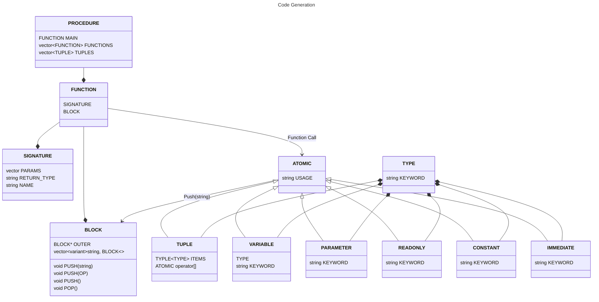
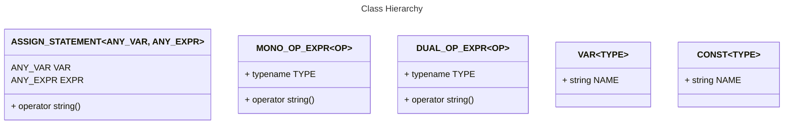

# Glan Document

This file contains how the language structure is designed within the context and constraints of C++. This file will detail how Glan is implemented in the source code rather than the usage of the language.

## Class & Concept Structure

